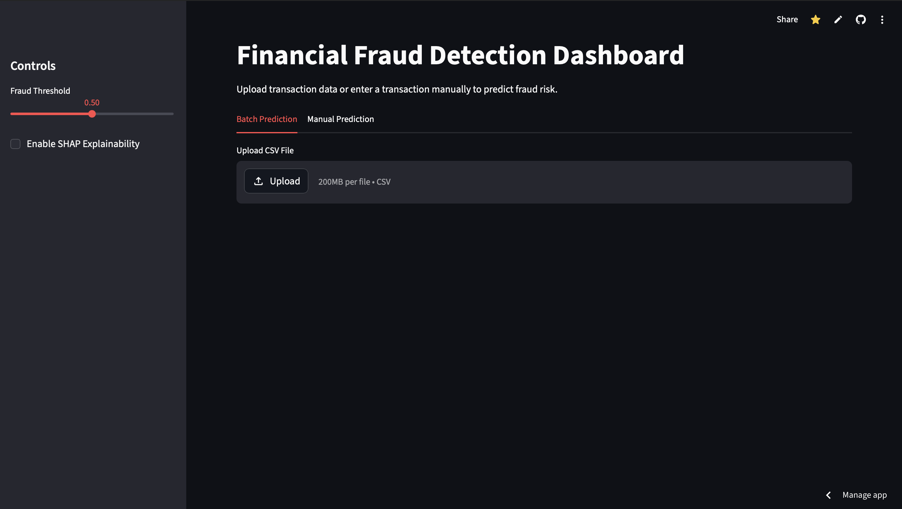
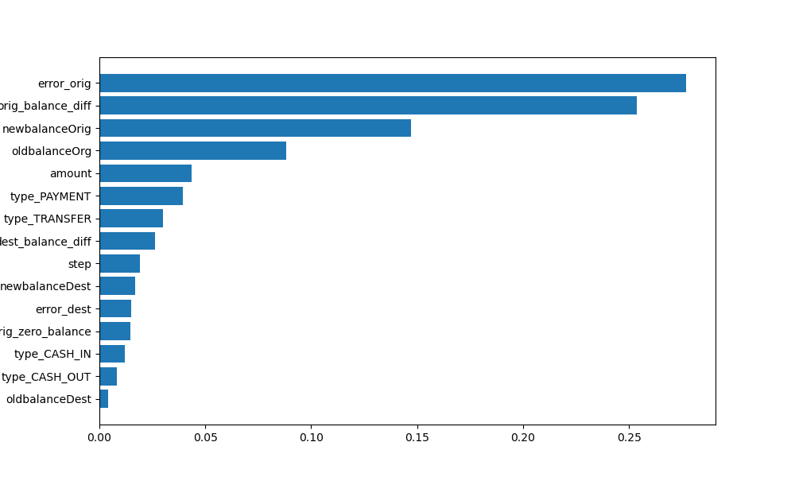
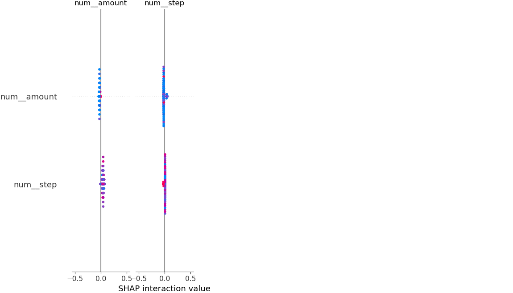
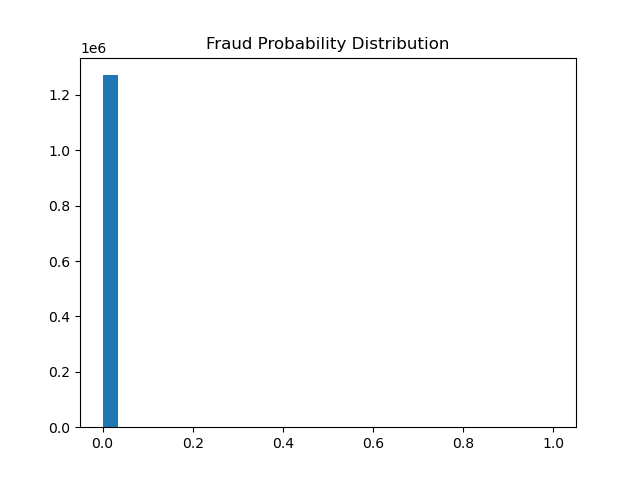

# Financial Fraud Detection Using Machine Learning

## Overview
This project builds an end-to-end machine learning system to detect fraudulent financial transactions.
Keywords: fraud detection, fintech, machine learning, anomaly detection, data science

The dataset contains transaction-level information such as:
- transaction type
- transaction amount
- sender and receiver balances
- fraud labels

It predicts whether a transaction is:
- 0 → Legitimate
- 1 → Fraudulent

---

## Problem Statement
Financial fraud is a major issue in digital payments and banking systems.

Traditional rule-based systems struggle to detect modern fraud patterns.  
Machine learning enables detection of hidden patterns in large-scale transaction data. :contentReference[oaicite:0]{index=0}

---
## Business Impact

This system can be used to:

- Detect fraudulent transactions in real-time
- Reduce financial losses
- Improve trust in digital payment systems

In production, similar systems are used in:
- Banking platforms
- Payment gateways
- Fraud monitoring pipelines

---

### Deployment Scenario

In a real system:

1. Transactions stream in real-time
2. Model assigns fraud probability
3. High-risk transactions are flagged
4. Human analysts review flagged cases


---
## Live Demo
[Streamlit App](https://machine-learning-for-financial-fraud-detection-f4sj6a3e4rasnpi.streamlit.app/)

---
## Dashboard Preview


## Feature Importance


## Model Explainability (SHAP)


## Probability Distribution



---
## Dataset

The dataset used in this project is publicly available on Kaggle:

- [Financial Fraud Detection Dataset (Kaggle)](https://www.kaggle.com/datasets/sriharshaeedala/financial-fraud-detection-dataset)

### Description
This dataset is a synthetic financial dataset generated using the PaySim simulator. It mimics real-world mobile money transactions and includes both legitimate and fraudulent activities.

### Key Characteristics
- 744 time steps (30 days of transactions)
- Multiple transaction types (CASH-IN, CASH-OUT, TRANSFER, etc.)
- Highly imbalanced (fraud cases are rare)
- Designed specifically for fraud detection modeling

| Feature | Description |
|--------|------------|
| step | Time step (1 step = 1 hour) |
| type | Transaction type (CASH-IN, CASH-OUT, TRANSFER, etc.) |
| amount | Transaction amount |
| nameOrig | Sender ID |
| oldbalanceOrg | Sender balance before transaction |
| newbalanceOrig | Sender balance after transaction |
| nameDest | Receiver ID |
| oldbalanceDest | Receiver balance before transaction |
| newbalanceDest | Receiver balance after transaction |
| isFraud | Target variable (0 = Legit, 1 = Fraud) |
| isFlaggedFraud | Flag for large illegal transactions |

---

## Project Workflow

### 1. Data Processing
- Loaded and cleaned dataset
- Removed duplicates
- Checked missing values


### 2. Exploratory Data Analysis
- Fraud distribution
- Fraud by transaction type
- Suspicious patterns

### 3. Feature Engineering
Created key features:
- `orig_balance_diff`
- `dest_balance_diff`
- `orig_zero_balance`
- `dest_zero_balance`
- `error_orig`
- `error_dest`

These capture inconsistencies in transactions, which are strong fraud indicators.

---

### 4. Preprocessing
- Numeric scaling (StandardScaler)
- Categorical encoding (OneHotEncoder)

### 5. Modeling
Models used:
- Logistic Regression (baseline)
- Random Forest (final model)

### 6. Model Evaluation
Metrics used:
- Precision
- Recall
- F1 Score
- ROC-AUC
- PR-AUC
Fraud detection focuses more on **recall and precision**, not accuracy.

---
## Model Decision Strategy

Fraud detection requires balancing:

- **High Recall** → Catch more fraud (fewer missed fraud cases)
- **High Precision** → Reduce false alarms

This project supports **threshold tuning**:

```python
threshold = 0.3  # Higher recall
threshold = 0.7  # Higher precision
```
This reflects real-world cost-sensitive fraud detection systems.
---

## Results

| Model | ROC-AUC | PR-AUC | Precision | Recall | F1_score |
|------|--------|--------|----------|-----------|----------|
| Logistic Regression | 0.995182 | 0.631581 | 0.024494 | 0.978089 | 0.047790 |
| Random Forest | 0.999086 | 0.998138 | 1.000000 | 0.997565 | 0.998781 |

---

## Key Insights

- Fraud is concentrated in specific transaction types (TRANSFER, CASH-OUT)
- Balance inconsistencies are strong fraud indicators
- Engineered features significantly improve model performance
- Random Forest outperforms Logistic Regression

---
Explainability (SHAP)
To improve transparency, SHAP was used to explain model predictions.
This helps:
- Understand why transactions are flagged
- Identify key drivers of fraud
- Improve trust in the model
- Explainability is critical in real-world fraud systems.

---

## Project Structure


```text
fraud-detection/
├── app/
│   └── dashboard.py
├── outputs/
│   └── fraud_predictions.csv
├── README.md
├── model.pkl
└── requirements.txt
```
---

## Streamlit Dashboard Features
- Upload transaction data
- Real-time fraud prediction
- Fraud probability scoring
- Summary metrics (fraud rate, counts)
- Interactive charts
- Download prediction results
- SHAP explainability

## Future Improvements
- XGBoost / LightGBM models
- SMOTE for imbalance handling
- Hyperparameter tuning
- SHAP explainability
- Real-time API deployment
  
## Technologies Used
- Python
- Pandas
- NumPy
- Scikit-learn
- Matplotlib
- Streamlit
- SHAP

---

## Author
- Caleb Gikombo - Mechatronics Engineer | Data Scientist
---
# License
This project is open-source and available under the MIT License.
